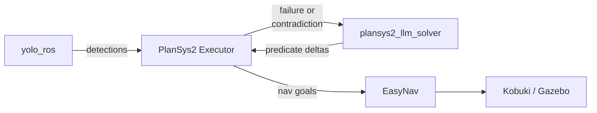

# plansys2-llm

Tools and demos for **LLM-assisted replanning in PlanSys2** — though the approach is planner-agnostic and applies to any PDDL-based planning system. When a classical planner hits an execution failure or a perception contradiction, an LLM is consulted to propose the world-state corrections needed to recover, and the planner replans from there. The current showcase is a service-robot demo where a Kobuki retrieves a misplaced book in a Gazebo bookstore.



---

## Repositories

| Repository | What it is |
|---|---|
| [`plansys2_llm_solver`](https://github.com/plansys2-llm/plansys2_llm_solver) | LLM-assisted replanner for PlanSys2. Invoked at runtime when execution fails or perception contradicts the world model and returns the predicate deltas needed to recover. |
| [`plansys2_llm_examples`](https://github.com/plansys2-llm/plansys2_llm_examples) | The `plan_bookstore` demo: PDDL domain, behavior trees, launch files, maps, book models — entry point of the project. |

## Stack

- **Robot:** Kobuki (simulated in Gazebo Sim, AWS RoboMaker bookstore world)
- **Navigation:** EasyNav (AMCL localizer + costmap planner/controller)
- **Perception:** YOLO via `yolo_ros`
- **Planning:** PlanSys2 with POPF, plus `plansys2_llm_solver` consulted at execution time
- **Behavior trees:** PlanSys2 BT actions (`move`, `pick_book`, `place_book`)

## Requirements

- Ubuntu 24.04
- ROS 2 [Jazzy](https://docs.ros.org/en/jazzy/Installation.html) or [Rolling](https://docs.ros.org/en/rolling/Installation.html)
- ~30 GB free disk, ≥16 GB RAM
- NVIDIA GPU optional (accelerates `llama_ros`)

---

<details>
<summary><b>Installation</b></summary>

Set the distro once per shell — every subsequent command uses `${ROS_DISTRO}`:

```bash
export ROS_DISTRO=jazzy   # or: rolling
source /opt/ros/${ROS_DISTRO}/setup.bash
```

### 1. System dependencies

```bash
sudo apt install -y \
  python3-colcon-common-extensions python3-rosdep python3-vcstool python3-pip \
  ros-${ROS_DISTRO}-ros-gz-sim ros-${ROS_DISTRO}-ros-gz-bridge \
  nlohmann-json3-dev \
  libusb-1.0-0-dev libftdi1-dev libuvc-dev
# libusb / libftdi / libuvc are required by kobuki_core and astra_camera —
# without them the first colcon build fails.

# ultralytics and lap aren't packaged in apt; pip3 is the only option.
# numpy<2 prevents pip from upgrading numpy and breaking cv_bridge.
# Do NOT install opencv-python — it shadows the system cv2 used by cv_bridge
# and causes a SIGSEGV in yolo_node.
pip3 install --break-system-packages "numpy<2" ultralytics lap huggingface_hub
```

### 2. Workspace

```bash
mkdir -p ~/TFG/src/{llm,navigation,perception,planning,robot/ThirdParty}
cd ~/TFG/src
```

### 3. Clone

```bash
# LLM
git clone -b ${ROS_DISTRO} https://github.com/mgonzs13/llama_ros.git llm/llama_ros

# Perception
git clone https://github.com/mgonzs13/yolo_ros.git perception/yolo_ros

# Planning
git clone -b ${ROS_DISTRO}-devel https://github.com/PlanSys2/ros2_planning_system.git planning/ros2_planning_system
git clone https://github.com/plansys2-llm/plansys2_llm_solver.git planning/plansys2_llm_solver
git clone https://github.com/plansys2-llm/plansys2_llm_examples.git planning/plansys2_llm_examples

# Robot meta-package
git clone -b ${ROS_DISTRO} https://github.com/IntelligentRoboticsLabs/kobuki.git robot/kobuki

# Pull third-party deps declared inside the meta repos
vcs import robot < robot/kobuki/thirdparty.repos
vcs import planning/ros2_planning_system < planning/ros2_planning_system/dependency_repos.repos
```

**Navigation — pick one route:**

- *Option A (recommended):* `sudo apt install -y ros-${ROS_DISTRO}-easynav`. Fast, no rebuild on EasyNav changes.
- *Option B (source):* clone EasyNav alongside the rest. Use this only if you need to track upstream or modify EasyNav itself, and **don't** also install the apt deb.

  ```bash
  git clone -b ${ROS_DISTRO} https://github.com/EasyNavigation/EasyNavigation.git  navigation/EasyNavigation
  git clone -b ${ROS_DISTRO} https://github.com/EasyNavigation/easynav_plugins.git navigation/easynav_plugins
  ```

### 4. Build

```bash
cd ~/TFG
sudo rosdep init || true
rosdep update
rosdep install --from-paths src --ignore-src -y -r --rosdistro ${ROS_DISTRO}
# If you went with EasyNav Option B, add: --skip-keys "easynav"

# CPU only (default):
colcon build --symlink-install --cmake-args -DBUILD_TESTING=OFF

# Or, with NVIDIA acceleration for llama_ros (driver: `nvidia-smi`,
# CUDA toolkit: `nvcc --version`):
# colcon build --symlink-install --cmake-args -DBUILD_TESTING=OFF -DGGML_CUDA=ON
```

If the build runs out of RAM (common with `llama_cpp_vendor` + `plansys2` in parallel), clean and retry single-threaded:

```bash
rm -rf build install log
colcon build --symlink-install --parallel-workers 1
```

</details>

<details>
<summary><b>Run</b></summary>

**Terminal 1** — simulator + navigation + perception + PlanSys2:

```bash
export ROS_DISTRO=jazzy
source /opt/ros/${ROS_DISTRO}/setup.bash
source ~/TFG/install/setup.bash

ros2 launch plan_bookstore bookstore_kobuki_launch.py \
  perception_mode:=sim displaced_book:=red_book
```

| Argument | Values | Default |
|---|---|---|
| `displaced_book` | `red_book`, `green_book`, `yellow_book`, `blue_book` | `blue_book` |
| `perception_mode` | `sim` (synthetic detections), `real` (YOLO via `yolo_ros`) | `sim` |
| `gui` | `true`, `false` | `true` |

The first launch with `perception_mode:=real` is slower — `yolo_ros` and `llama_ros` fetch their model weights on demand.

**Terminal 2** — reception controller (drives the demo and consults the LLM solver):

```bash
export ROS_DISTRO=jazzy
source /opt/ros/${ROS_DISTRO}/setup.bash
source ~/TFG/install/setup.bash

ros2 run plan_bookstore reception_controller_node \
  --ros-args \
  --params-file ~/TFG/src/planning/plansys2_llm_examples/params/planner_param.yaml \
  -p displaced_book:=red_book
```

Swap `planner_param.yaml` for any other profile under `plansys2_llm_examples/params/` (e.g. `planner_param_with_args.yaml`) to change planner/solver behavior without rebuilding.

**Expected:** Gazebo opens with the bookstore world and a Kobuki spawned at the reception desk; terminal 1 prints PlanSys2 lifecycle activations; terminal 2 publishes the plan and the robot drives toward the displaced book.

</details>

<details>
<summary><b>Optional tweaks</b></summary>

These edits live in third-party repos and cannot be committed here. Apply after cloning if you want a smoother demo.

**Kobuki LiDAR — 360° field of view.** Default is a 180° frontal sweep; AMCL and the costmap behave better with the full 360°. Edit `src/robot/ThirdParty/kobuki_ros/kobuki_description/urdf/kobuki_gazebo.urdf.xacro`:

```xml
<min_angle>-3.1416</min_angle>   <!-- was -1.5708 -->
<max_angle>3.1416</max_angle>    <!-- was  1.5708 -->
```

Then: `colcon build --packages-select kobuki_description --symlink-install`.

**LLM model — CPU or GPU.** The demo loads `Qwen2.5-3B-Instruct` from `src/llm/llama_ros/llama_bringup/models/Qwen2.5-3B.yaml`, configured for CPU inference (4 threads, ~2 GB weights). To run on GPU (build with `-DGGML_CUDA=ON`), set `n_gpu_layers: -1`:

```yaml
/**:
  ros__parameters:
    # Model parameters
    model:
      repo: bartowski/Qwen2.5-3B-Instruct-GGUF
      filename: Qwen2.5-3B-Instruct-Q4_K_M.gguf

    # Context / inference parameters
    context:
      n_ctx: 8192
      n_batch: 512
      n_predict: 512

    # GPU / backend parameters
    gpu:
      n_gpu_layers: 0   # set to -1 for full GPU offload

    # CPU parameters
    cpu:
      n_threads: 4

    # Prompt & chat parameters
    prompt:
      system_prompt_type: ChatML
```

No rebuild needed (the YAML is read at launch). Measured end-to-end latency on the real demo prompt (~3 050 tokens):

- **RTX 3050 Ti** (GPU): ~3.9 s per call.
- **i7-12700H @ 4 threads** (CPU): ~11 s per call.
- **Raspberry Pi 5 16 GB** (CPU): ~3:19 first call (cold), ~0:48 for subsequent replans. The warm latency comes from `pre_launch: true` keeping the `llama_node` alive and `cache_prompt: true` reusing the prompt prefix between solver calls.

</details>

<details>
<summary><b>Real robot (optional)</b></summary>

The bookstore demo runs in Gazebo, so the steps above are enough. To drive a physical Kobuki, install udev rules so `/dev/kobuki`, `/dev/rplidar`, etc. appear with the right permissions:

```bash
cd ~/TFG
sudo cp src/robot/ThirdParty/ros_astra_camera/astra_camera/scripts/56-orbbec-usb.rules /etc/udev/rules.d/
sudo cp src/robot/ThirdParty/rplidar_ros/scripts/rplidar.rules /etc/udev/rules.d/
sudo cp src/robot/ThirdParty/kobuki_ros/60-kobuki.rules /etc/udev/rules.d/
sudo udevadm control --reload-rules && sudo udevadm trigger
```

Launch the real-robot stack (sensors are off by default):

```bash
ros2 launch kobuki kobuki.launch.py                     # base only
ros2 launch kobuki kobuki.launch.py lidar_a2:=true      # or lidar_s2 / xtion / astra
```

Hardware-specific quirks: <https://github.com/IntelligentRoboticsLabs/kobuki/tree/jazzy>.

</details>

<details>
<summary><b>Troubleshooting</b></summary>

When something specific to a stack fails and the notes above don't help, the upstream repos are the source of truth:

- Kobuki — <https://github.com/IntelligentRoboticsLabs/kobuki/tree/jazzy>
- EasyNavigation — <https://github.com/EasyNavigation/EasyNavigation>
- PlanSys2 — <https://github.com/PlanSys2/ros2_planning_system>
- llama_ros — <https://github.com/mgonzs13/llama_ros>
- yolo_ros — <https://github.com/mgonzs13/yolo_ros>

</details>

---

| | |
|---|---|
| **Author** | Álvaro Valencia |
| **Advisor** | Francisco Martín Rico |
| **Institution** | Universidad Rey Juan Carlos (URJC) |
| **Year** | 2026 |
| **License** | Apache 2.0 (org repos); upstream stacks keep their own licenses |
